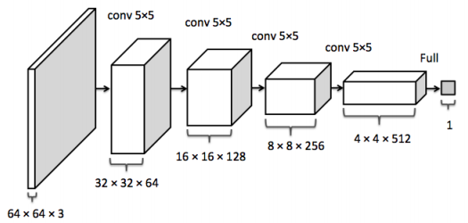
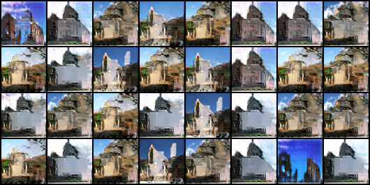
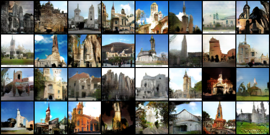

# DCGAN implemented in PyTorch

The paper: [Unsupervised Representation Learning with Deep Convolutional Generative Adversarial Networks](https://arxiv.org/abs/1511.06434)

---

## Model & Train

The model and train progress follow the paper. As it gives specific model for LSUN dataset (see below), so the code implements this model only.

Architecture of generator:

Architecture of discriminator:

As said in the paper, architecture guidelines for stable DCGANs:

* Replace any pooling layers with strided convolutions (discriminator) and fractional-strided convolutions (generator).
*  Use batchnorm in both the generator and the discriminator.
* Remove fully connected hidden layers for deeper architectures.
* Use ReLU activation in generator for all layers except for the output, which uses Tanh.
* Use LeakyReLU activation in the discriminator for all layers

Some details are:

* No pre-processing is applied to training images besides scaling to the range of the tanh activation function \[-1, 1\];
* Batch size 128;
* All weights are initialized from a zero-centered Normal distribution with standard deviation 0.02;
* In the LeakyReLU, the slope of the leak was set to 0.2;
* Use the Adam optimizer with tuned hyperparameters: learning rate 0.0002, beta1 0.5, beta2 0.999.

Additional tricks:

* Use one-sided smooth;
* Use an alternative loss.

## Results

For the dataset LSUN-bedroom is too big, I trained the model with LSUN-church_outdoor instead.

At the 1st training (named model1), I applied `Batch Normalization` to the output layer of generator mistakenly. As a result, the generated samples were so blurred that they just had the roughly contour of churches (see below). In addition, the noise as well as fixed noise is sampled from uniform distribution.

At the 2nd training (named model2), I changed the noise distribution to normal distribution.

|  | epoch1 | epoch10 | epoch50 | gif |
| --- | --- | --- | --- | --- |
| Model1 |  |  |  |  |
| Model2 |  |  |  |  |
| Real samples|  |  |  |  |

As you can see, the generator in model2 could generate somewhat realistic images, though compared to real ones, these images are more like paintings.

The following 2 images show image transfer due to interpolation of noise. (model2)

