# Original GAN implemented in PyTorch

The paper: [Generative Adversarial Nets](https://papers.nips.cc/paper/5423-generative-adversarial-nets.pdf)

The official code: [https://github.com/goodfeli/adversarial](https://github.com/goodfeli/adversarial)

---

## Model1
The model and train progress follow Ian's code and the paper.

| Discrinator | Generator |
| --- | --- |
| Input ∈ $R^{784}$ | Input ∈ $R^{100}$ |
| Dropout. 240,5 Maxout. | FC. 1200 RELU. |
| Dropout. 240,5 Maxout. | FC. 1200 RELU. |
| Dropout. Sigmoid. | Sigmoid. |

| Hype-parameters | learning rate | decay facotr |momentum | optimizer |
| --- | --- | --- | --- | --- |
| Values | 0.1->0.000001 | 1.000004 | 0.5->0.7 | SGD |

However, there are some differences between Pylearn2 and PyTorch. I tried to reproduce Ian's work completely without later tricks, but failed to some extent. So I leave what I don't understand for future study, including:

* Likelihood Estimation. (So does early-stopping)
* More proper momentum adjustment. (PyTorch does not support this feature at present.)
* For generator, `init_sigmoid_bias_from_marginals` (the exact function in Pylearn2)

Some later tricks I used here includes:

1. Alternative heuristic loss function (See [this blog](https://wiseodd.github.io/techblog/2016/09/17/gan-tensorflow/) for more explanation.)

As a result, it comes to `mode collapse` immediately. The generator always generates the same image after one training step and its loss gets larger and lager.

I adjust the architecture of the generator mildly -- just add `Batch Normalization` layers. There comes model2. To my surprise, it really helps. Moreover, as [the paper](https://arxiv.org/pdf/1502.03167.pdf) says, Batch Normalization accelerates the training progress.

---

## Model3

So I changed the architecture to what described in the InfoGAN paper. To my satisfaction, it got wonderful result.

The architecure is exactly the same as in InfoGAN:

| Discrinator | Generator |
| --- | --- |
| Input 28 × 28 Gray image | Input ∈ $R^{74}$ |
| 4 × 4 conv. 64 Leaky RELU. stride 2 | FC. 1024 RELU. batchnorm |
| 4 × 4 conv. 128 Leaky RELU. stride 2. batchnorm | FC. 7 × 7 × 128 RELU. batchnorm |
| FC. 1024 Leaky RELU. batchnorm | 4 × 4 upconv. 64 RELU. stride 2. batchnorm |
| FC. output layer | 4 × 4 upconv. 1 channel |

## Result

| Name | epoch1 | epoch10 | epoch50 | gif | remarks |
| --- | --- | --- | --- | --- | --- |
| Model1 | 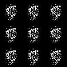 | 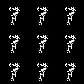 | 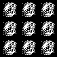 | 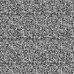 | Ulmately the G fails to fool the D.|
| Model2 | 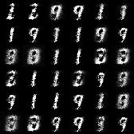 | 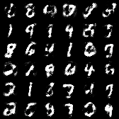 | 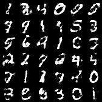 | 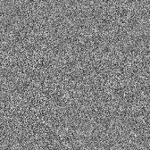 | |
| Model3 | 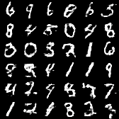 | 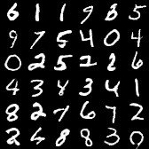 | 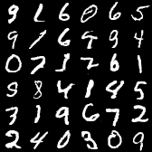 | 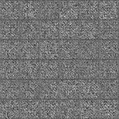 | |

---

You can run [sampler.py](sampler.py) to see the effects of generator after training. The code uses [Google Fire](https://github.com/google/python-fire) to offer CLIs, so it's rather easy to use.
(PS: For the checkpoint file is too, I do not upload them.)
