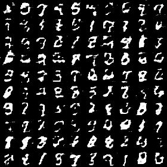
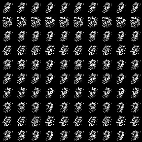

# Conditional GANs implemented in PyTorch

The paper: [A Study of Smoothing Methods for Language Models Applied to Information Retrieval](https://arxiv.org/pdf/1411.1784.pdf)

This work tries to reproduce cGAN (Conditional GAN) refer only to the paper, without any later tricks but an alternative heuristic loss function. See [model1.py](model.py)

| Discrinator | Generator |
| --- | --- |
| X Input ∈ R^784; y input ∈ $r^10$ | z Input ∈ $r^100$; y input ∈ $r^10$ |
| 240,5 Maxout; OneHot. 50,5 Maxout. | FC. 1000 RELU; OneHot. FC. 200 RELU|
| Dropout(0.5). 290,4 Maxout. | Dropout(0.5). FC. 784 RELU. Sigmoid |
| Dropout(0.5). FC. Sigmoid. | |

| Hype-parameters | learning rate | decay facotr |momentum | optimizer |
| --- | --- | --- | --- | --- |
| Values | 0.1->0.000001 | 1.00004 | >0.7 | SGD |

[model2.py](model2.py) is used as a contrast model which has additional Batch Normlization layer in Generator.

| Discrinator | Generator |
| --- | --- |
| X Input ∈ R^784; y input ∈ $r^10$ | z Input ∈ $r^100$; y input ∈ $r^10$ |
| 240,5 Maxout; OneHot. 50,5 Maxout. | FC. BatchNorm. 1000 RELU; OneHot. FC. BatchNorm. 200 RELU |
| Dropout(0.5). 290,4 Maxout. | Dropout(0.5). FC. 784 RELU. Sigmoid |
| Dropout(0.5). FC. Sigmoid. | |

## Result

| Name | epoch1 | epoch10 | epoch50 | gif | remarks |
| --- | --- | --- | --- | --- | --- |
| Model1 |  |  |  |  | It still need time to converge. |
| Model2 |  |  |  |  | It shows that BN really herlps accelerating training. |

